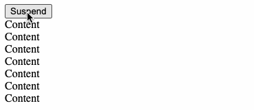

Suspense, which shows the fallback on top of previous content.



## Example

```js
import Suspense from "suspense-overlay";

export default function App() {
  return <Suspense fallback="loading...">...</Suspense>;
}
```

## With MUI Backdrop


```js
import { alpha, Backdrop, Box, CircularProgress } from "@mui/material";
import { SuspenseOverlayCore } from "suspense-overlay";

export default function MuiBackdropSuspense({ children }) {
  return (
    <Box sx={{ position: "relative", display: "grid" }}>
      <SuspenseOverlayCore
        fallback={
          <Backdrop
            sx={{
              position: "relative",
              gridArea: "1 / 1",
              backgroundColor: (theme) =>
                alpha(theme.palette.background.paper, 0.5),
            }}
          >
            <CircularProgress />
          </Backdrop>
        }
      >
        <Box sx={{ gridArea: "1 / 1" }}>{children}</Box>
      </SuspenseOverlayCore>
    </Box>
  );
}
```

## `<Suspense>`

### Props

| Name       | Description            |
| ---------- | ---------------------- |
| `children` | As in `React.Suspense` |
| `fallback` | As in `React.Suspense` |

#### Optional

| Name                  | Type                    | Default value                                                  | Description                                                                                                                         |
| --------------------- | ----------------------- | -------------------------------------------------------------- | ----------------------------------------------------------------------------------------------------------------------------------- |
| `Backdrop`            | `React.ElementType`     | styled `div`                                                   | A Component that wraps and centers `fallback`                                                                                       |
| `ChildrenWrapper`     | `React.ElementType`     | `contained`: styled `div` <br/> `contained=false`: `div`       | A Component that wraps `children`                                                                                                   |
| `Container`           | `React.ElementType`     | `contained`: styled `div` <br/> `contained=false`: `undefined` | A Component that wraps `SuspenseOverlayCore`                                                                                        |
| `Fallback`            | `React.ElementType`     | [`Fallback`](src/Fallback.tsx)                                 | React Transition Group / CSSTransition                                                                                              |
| `contained`           | `boolean`               | `true`                                                         | Set `false` to show a fullscreen/uncontained overlay                                                                                |
| `fullscreenContainer` | `string \| HTMLElement` | `document.body`                                                | A default value for `container`. Used also to apply different styles.                                                               |
| `container`           | `string \| HTMLElement` | `fullscreenContainer`                                          | A query selector for an element or a reference to an element that the fullscreen/uncontained `Backdrop` & `fallback` is rendered to |
| `contained`           | `boolean`               | `true`                                                         | Set `false` to show a fullscreen overlay                                                                                            |

see [Fallback.tsx](src/Fallback.tsx) for more overrides and details.

<!--
| `OverlayPortal`       | `React.ElementType`     | styled `div`                                                   | When `contained=false`, this wraps the `Backdrop` & `fallback`                                                                      |
| `Overlay`             | `React.ElementType`     | Component                                                      | Selects weather to render contained or uncontained Overlay                                                                          |
| `visibleStyles`       | `CSSInterpolation`      | `backdrop-filter: blur(4px);`                                  | Styles applied to `Overlay` when `fallback` is visible                                                                              |
| `hiddenStyles`        | `CSSInterpolation`      | `backdrop-filter: blur(0px);`                                  | Styles applied to `Overlay` when `fallback` is hidden                                                                               |

-->

## `<SuspenseOverlayCore>`

### Props

| Name       | Type                 | Default value | Description                                                                                                                    |
| ---------- | -------------------- | ------------- | ------------------------------------------------------------------------------------------------------------------------------ |
| `children` | `React.ReactElement` | -             | As in `React.Suspense`. Must also be a valid argument for `React.cloneElement` and forward `ref` to the outermost DOM element. |
| `fallback` | `React.ReactElement` | -             | As in `React.Suspense`. Must also be a valid argument for `React.cloneElement`.                                                |
| `inProp?`  | `string`             | `"open"`      | A prop name of a `boolean` that the `fallback` should use to be visible or hidden                                              |
